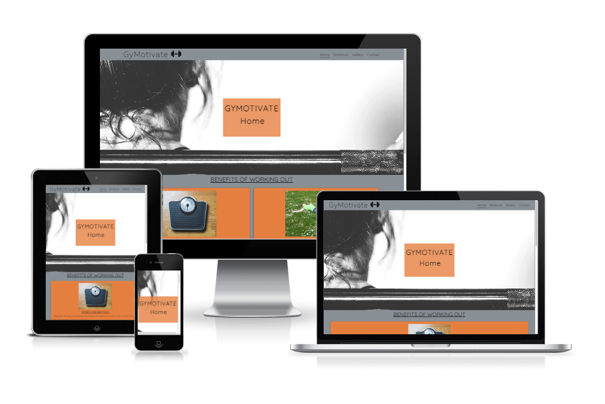
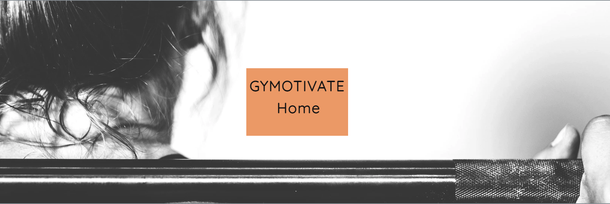
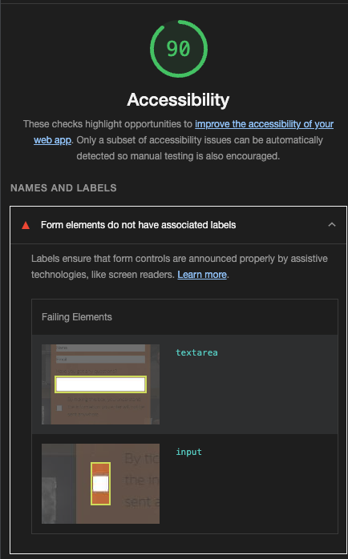

# __GyMotivate - Portfolio Project 1__

GyMotivate hopes to encourage people to better themselves by taking up physical activity and reap its benefits mentally and physically. The site will be targeted towards those who are unsure whether or not regular exercise can benefit them.

## Live Site
[GyMotivate](https://lestercuasay.github.io/Project-1/)

## Repository
https://github.com/LesterCuasay/Project-1

***
## __Objective__
In this project I intent to create a website containing basic information why physical activity can benefit your lifestyle.

The main objective of this project is to make a website solely on HTML and CSS. Also to make the site responsive between different devices.
___
### __Goals__
The goal of this website is to encourage the users to take up physical activity.

- A well designed front page with brief sentences to engage users.
- A page containing information abotu different workouts
- A gallery showing other people in the gym and also a motivation video.
- A contact form, where a user can pass on feedback.

***
## __UX & Design__
___

### User Stories
 - As a first time user, I want to be able to easily navigate the site on different devices i.e mobile tablet etc.
 - As a returning user, I want to be able to get to the top of the page with ease.
 - As a user, I want to find out different benefits of physical activity.
 - As a user, I want to be able to get in contact and provide feedback.

***
## __Initial Concept__
___
I hope to deliever a website that is eye catching for the user with little to no distractions with the background or out of placed imagery/text. The site also needs to be easily navigated whether be on desktop, tablet or mobile devices.

### Wireframes
___
As part of the planning stage, I created wireframes using [Balsamiq](https://balsamiq.com/). This allowed me to have a general idea how i wanted to layout my website.

Though throughout the making of the website the design slightly changed due to feedback from others to make the website look more appealing.

- The layout for the homepage and workout page is the same to make it easier for users to navigate through the website. Though there is clear indication which page they are on.

 - The layout for the gallery page, I had to change the layout in the actual website as the images were being warped in different dimensions so i decided to use flex.

 
 - The layout for the contact page, the thank-you page also runs the same layout though without the form in the middle. Instead it is the results from the information submitted.

### Colour Scheme
___

I used [Coolors.co](https://coolors.co/) to choose my colour scheme.

The background I have chosen for the wbeiste is #929aa0 which is Spanish Grey. The text for the whole website is #131112 which is Smoky Black to get with the Spanish Grey Background.

Although for the main content area i used #f4813e which is Mango Tango for the background for the boxes to give it a more appealing style.

### Typography
___

For the website, I am using [Google Fonts](https://fonts.google.com/). 
I decided to use Quicksand for the heading text of the website and Kanit for the body text.

For the font pairings I used [Fontjoy](https://fontjoy.com/)

***
## __Features__
___

These elements appear in every page of the website as the user navigates through it.

### Logo and Navigation Bar
___

- The logo and navigation bar appears on every page of the website. Each of the links on the nav bar will send the user to the targeted pages.

### Main Image
___

- The main image appears on the hompage and workout page, each page will display corresponding text which page they are so it will be easier for the user to know what page they are on. This image is also responsive along with the text in the middle for different screen sizes.

### Footer
___

- The footer shows in every page and are linked to their corresponding social media websites for customers to stay up to date with our content.

***
## __Technologies Used__
___

### Languages Used

- [HTML](https://en.wikipedia.org/wiki/HTML5)
- [CSS3](https://en.wikipedia.org/wiki/CSS)
- [Javascript](https://www.javascript.com/) 
   - Javascript is only used to pass data from contact page to thank-you page.
- [Font Awesome](https://fontawesome.com/)
    - Used in the footer for the icons and the icon on the logo.
- [Google Fonts](https://fonts.google.com/)
    - Used for the font-family for the website.
- [Balsamiq](https://balsamiq.com/)
    - Used for initial design planning.

***
## __Testing__
___

[Testing](TESTING.md) (Seperate ReadMe)

***
## Bugs
___

### Current Bugs

There are no bugs I am currently aware of.

### Resolved Bugs

Bug: The link area was too big so where the green square was the link can be clicked.

Fix: Lowered the padding to get the area of the link smaller.

Bug: The Form elements of text area and checkbox didn't have a label.

Fix: Gave both the elements a label.

***

## __Deployment__
___

### GitHub Pages
This site was deployed using GitHub Pages using these steps:

1. Log in to GitHub and go to the project [GitHub Repository](https://github.com/LesterCuasay?tab=repositories)
2. Locate the Navbar of the project and click on Settings tab.
3. On the settings on the left hand side, locate "Pages" under "Code and automation".
4. On the Branch where it says "None" click the drop down and click select "Main" and click save.
5. The page will automatically refresh.
6. A notification will appear at the top of the settings page with a [link](https://lestercuasay.github.io/Project-1/) to the deplyed site. You can return to this GitHub Pages section to access the link.

### Forking the Github Repository

Forks are used to be able to change someone else's project as your own idea. By forking the Github Respository you make a copy of the original on your GitHub account to view/or make changes without affecting the original repository.

To Fork a Github Repository:
1. Log in to GitHub and go to the project [GitHub Repository](https://github.com/LesterCuasay?tab=repositories)
2. Locate the Fork button in the top-right corner of the page and click Fork.
3. You should now have a copy of the original repository in your GitHub Account.

### Making a Local Clone

To Clone the repository: 
1. Log in to GitHub and go to the project [GitHub Repository](https://github.com/LesterCuasay?tab=repositories)
2. On the repository page, find and click on the 'Code' menu in the middle of the screen.
3. There are multiple ways of doing this next step:
    - To clone the repository using HTTPs, under "Clone with HTTPS", click 'copy' icon.
    - To clone the repository using an SSH key, including a certificate issued by your organisation's SSH certificate authority, click 'Use SSH', then click the 'copy' icon.
    - To clone a repository using GitHub CLI, click 'Use GitHub CLI', then click the 'copy' icon.
4. Open Git Bash.
5. Change the current working directory to the locaiton where you want the clone directory.
6. Type 'git clone', and paste the URL you copied.
7. Press Enter.

For more information about Forking, click on this [GitHub Guide](https://docs.github.com/en/github-ae@latest/get-started/quickstart/fork-a-repo).

## __Credits__
___

 - Hero Image was inspired from the [Love Running](https://github.com/LesterCuasay/Love-Running-Essentials-Project) CI Project.
 - The script used to pass data from contact.html to thank-you.html can be found [here](https://stackoverflow.com/a/51123522).
 - All Images used for the website are from [Pexels](https://www.pexels.com/).
 - The Icons on the logo and footer are from [Font Awesome](https://fontawesome.com/)
 - This game helped me learn a little bit more of [Flexbox](https://flexboxfroggy.com/)

