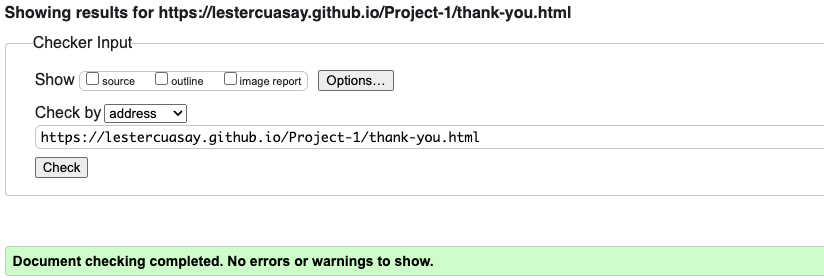

# __Testing__

## Introduction

To make sure that my website is running as intended, I will be using different tools to see its performance.

- Every page will be tested on lighthouse for PC and Mobile.
- Every page's HTML will be checked on [W3C Validator](https://validator.w3.org/)
- Every page's CSS will be checked on [W3C Validator - Jigsaw](https://jigsaw.w3.org/css-validator/)

***

## __Browser Testing__

- Firefox - No errors identified.
- Microsoft Edge - No errors indentified.
- iPhone (Mobile) - No errors indentified.
- Chrome - This is the browser I have tested the most as i build the website using chrome. Detailed testing will be below.

***

## __CSS Stylesheet__

- CSS Stylesheet has passed Jigsaw with no errors found. 

    

***

## __Homepage (index.html)__

[index.html](https://lestercuasay.github.io/Project-1/index.html)

### PC

### Mobile

### W3C HTML Validator

***
## __Workouts (workout.html)__

[workout.html](https://lestercuasay.github.io/Project-1/workout.html)

### PC

### Mobile

### W3C HTML Validator

***
## __Gallery (gallery.html)__

[gallery.html](https://lestercuasay.github.io/Project-1/gallery.html)

### PC

### Mobile

### W3C HTML Validator

***
## __Contact-Us (contact-us.html)__

[contact-us.html](https://lestercuasay.github.io/Project-1/contact-us.html)

### PC

### Mobile

### W3C HTML Validator

***
## __Thank-you (thank-you.html)__

[thank-you.html](https://lestercuasay.github.io/Project-1/thank-you.html?name=Lester+&email=lestercuasay%40live.co.uk&feedback=&confirm=confirm)

### PC

### Mobile

### W3C HTML Validator

            

